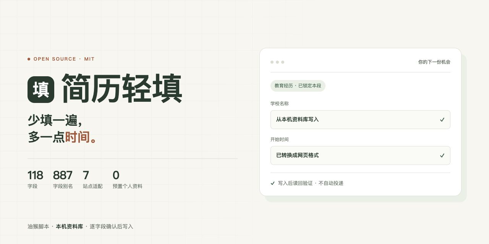

<div align="center">



# 简历轻填

把 PDF、Word 简历变成一份存在自己电脑上的资料库，在不同招聘页面按字段复用。写完逐字段读回确认，不会替你投出去。<br>
118 个字段、887 个字段别名、11 个资料模块、7 个站点适配器。公开版以空白资料启动，不含任何人的简历、联系方式或使用记录。

不用先建库：第一次用可以只试一个字段，确认读回没问题，再慢慢往下走。

[](https://yshk9364-ux.github.io/resume-light-fill/)
[](#资料模块)
[](#字段是怎么被认出来的)
[](#站点适配)
[](#公开版说明)
[](#许可)

### [打开在线主页](https://yshk9364-ux.github.io/resume-light-fill/) · [安装脚本](https://raw.githubusercontent.com/yshk9364-ux/resume-light-fill/main/docs/download/%E7%AE%80%E5%8E%86%E8%BD%BB%E5%A1%AB.user.js) · [看看怎么用](#怎么用)

<table>
<tr><td align="right"><b>安装</b></td><td align="left">

[油猴脚本（推荐）](https://raw.githubusercontent.com/yshk9364-ux/resume-light-fill/main/docs/download/%E7%AE%80%E5%8E%86%E8%BD%BB%E5%A1%AB.user.js) — 单文件，约 880 KB，需要先装 Tampermonkey / Violentmonkey

</td></tr>
<tr><td align="right"><b>查阅</b></td><td align="left">

[怎么用](#怎么用) · [核心功能](#核心功能) · [字段是怎么被认出来的](#字段是怎么被认出来的) · [资料模块](#资料模块) · [站点适配](#站点适配)

</td></tr>
<tr><td align="right"><b>了解</b></td><td align="left">

[数据与 AI](PRIVACY.md) · [公开版说明](#公开版说明) · [开发](#开发) · [支持项目](#支持项目)

</td></tr>
</table>

</div>

---

## 这个脚本想回答的问题

| 问题 | 怎么解决 |
| --- | --- |
| 一份简历要投十几个招聘站，每个站都从零手填？ | 资料存一次，之后按字段复用，不用重复粘贴 |
| 网申的日期控件格式各不相同（`2024.03` / `2024/3` / `2024年3月`）？ | 按当前网页的格式转换，填入前先给你看转换结果 |
| 「3 年以上经验」「薪资面议」这类区间怎么取？ | 薪资和年限换算先预览，取哪一端由你选 |
| 想把 PDF 里的经历变成能复用的结构化资料？ | 文档导入，每条都要求原文依据，和已有值冲突时单独列出来 |
| 不想让 AI 提纯的内容混进正式资料库？ | 「识别并存入字段库」和「仅作为 AI 知识库」是两个独立入口，互不污染 |
| 简历内容会不会发到作者服务器？ | 不会。全部存在脚本管理器的本机存储里，脚本没有后端 |
| 会不会自动帮我投？ | 不会。写入后读回检查，投递动作始终由你自己点 |

## 怎么用

1. **装脚本管理器**：Tampermonkey 或 Violentmonkey 都行。
2. **装脚本**：点上面的[安装链接](https://raw.githubusercontent.com/yshk9364-ux/resume-light-fill/main/docs/download/%E7%AE%80%E5%8E%86%E8%BD%BB%E5%A1%AB.user.js)，或者把仓库里的 `userscript/dist/简历轻填.user.js` 导入脚本管理器。
3. **建自己的资料**：右下角助手里点「资料」，可以手动填，也可以把 PDF / Word / Markdown / 文本丢进去自动识别。
4. **点网页上的字段**：助手会推荐对应内容，你核对后点写入。选好具体一段经历可以锁定识别范围，避免跨段串用。
5. **投递前自己再看一遍**：工具会读回检查网页有没有真的保留内容，但最终提交始终由你点。

## 核心功能

- 资料按 11 个模块管理，基本信息、教育、工作、项目、荣誉、证书、语言、技能、家庭各自独立。
- 手选具体经历后**锁定识别范围**，只在这段里匹配，不会把上一段的公司名填到下一段。
- 日期按网页控件选择；薪资和年限换算**先预览再写入**；区间可以自己选取值方式。
- 确认过的新字段会保存下来，之后按名称或别名自动匹配。
- 文档导入提供两个独立入口：**识别并存入字段库**、**仅作为 AI 提纯知识库**。
- 字段导入要求原文依据，保留已有值和锁定字段，冲突单独列出；多段经历分别导入。
- AI 提纯出的知识可以查看、编辑、删除，文字能跨招聘网站检索，随备份一起导出。
- 写入后逐字段读回验证，失败会明确告诉你哪个字段没写进去。

## 字段是怎么被认出来的

118 个字段，每个字段带一组别名，一共 887 条。别名是这个脚本的核心：招聘网站的标签五花八门，同一个「开始时间」可能写成 `起始时间`、`任职时间`、`Start Date`、`入职时间`、`开始年份`。

匹配时会先做 NFKC 归一化、转小写、去掉空白和标点，再比对名称和别名，所以 `Start Date`、`start-date`、`startdate` 能落到同一个字段。日期、薪资、年限、等级这几类还有各自的换算逻辑，不按纯文本比。

命中哪个字段、依据哪条别名，都会在写入前显示出来。

## 资料模块

| 模块 | 字段数 | 说明 |
| --- | --- | --- |
| 基本信息 | 45 | 姓名、联系方式、政治面貌、出生日期、户籍等 |
| 教育经历 | 16 | 学校、专业、学历、起止时间、在校经历 |
| 工作／实习经历 | 13 | 单位、职位、起止时间、工作描述、薪资 |
| 校园／学生工作 | 7 | 社团、职务、起止时间 |
| 项目经验 | 6 | 项目名、角色、起止时间、描述 |
| 奖项／荣誉 | 5 | 名称、级别、授予时间 |
| 证书 | 4 | 名称、取得时间 |
| 语言能力 | 5 | 语种、等级、证书 |
| 专业技能 | 3 | 技能、熟练度 |
| 计算机技能 | 4 | 工具、熟练度 |
| 家庭关系 | 10 | 关系、姓名、单位、职务 |

## 站点适配

7 个站点适配器，每个就是一组 CSS 选择器（分段、记录项、添加／编辑／保存按钮），写在 `extension/site-rules.json` 里：

| 适配器 | 站点 |
| --- | --- |
| HotjobAdapter | hotjob.cn |
| BeisenAdapter | beisen.com、italent.cn |
| MokaAdapter | mokahr.com |
| 51jobAdapter | 51job.com |
| ZhaopinCampusAdapter | xiaoyuan.zhaopin.com |
| LiepinAdapter | liepin.com |
| ChinaPostAdapter | chinapost.com.cn |

**没有列出的站点也能用**——通用引擎照样扫描和填写，只是站点适配决定了分段和记录项识别得更准。适配器写得对不对，最终还得在真实网站上核对一次。

## 公开版说明

公开版本以**空白资料**启动：所有个人字段、经历、预置答案和个人知识都是空的，也不含作者的简历、联系方式、素材或使用记录。仓库里只有运行源码、公开测试、构建文件、说明、展示页面，以及授权保留的收款二维码区域。

请不要把自己的简历、导出备份、API key 或页面存档提交到仓库。

## 数据与 AI

- 个人资料、常用字段、知识文本和配置保存在**脚本管理器的本机存储**里，备份包含个人内容，请自己保管。
- 文档识别／提纯或主动 AI 生成会调用**你配置的服务**。文档路径先过滤身份证号、手机号、银行卡和相关敏感行；联系电话由本地规则提取。过滤无法保证去掉文档里的全部敏感内容，发送前可以先编辑原文。
- **不会**自动向作者上传简历、API key 或使用记录，不内置统计跟踪。
- 招聘网页按你点「写入」接受对应字段内容，**不会自动投递**。
- 从第三方 CDN 加载 PDF / Word 解析库；AI 服务与 CDN 的数据处理政策由对应服务提供方负责。

完整说明见 [PRIVACY.md](PRIVACY.md)。

## 开发

```sh
npm ci
npm run build:userscript
npm test
```

改 `userscript/src/` 里的模块；引擎代码在 `extension/core/`，由 `scripts/build.cjs` 按 `scripts/modules.json` 的顺序打包成 `extension/engine.js`。**改了 `core/` 一定要重新构建**，否则不生效。

测试是 `node --test tests/*.test.cjs`，当前 9 个用例，覆盖文档导入、空白启动、赞助入口与提醒逻辑。

`docs/` 是无后端的静态页面，部署在 GitHub Pages 上。横幅 `og.png` 的源文件在 `tools/og-banner.html`，改完按 1280×640 截图覆盖即可。

## 支持项目

一个人维护，需要时间，也需要一点动力。在助手里点「支持」，或打开[项目介绍与赞助页面](https://yshk9364-ux.github.io/resume-light-fill/#support)（仓库内副本：[docs/index.html](docs/index.html)）。微信支付和支付宝分别标注，金额是自愿建议，需要在支付应用内自行输入。

公开脚本累计首次使用超过 30 分钟、成功写入至少 10 次后才可能提醒，自动提醒最多每 7 天一次。可以选「今日不再提醒」「以后不再提醒」「已支持」。**不会验证支付状态，不会限制免费功能**——所有功能始终免费。

## 许可

[MIT](LICENSE)。Copyright (c) 2026 Resume Light Fill contributors。
